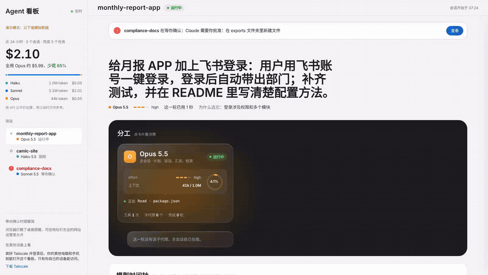
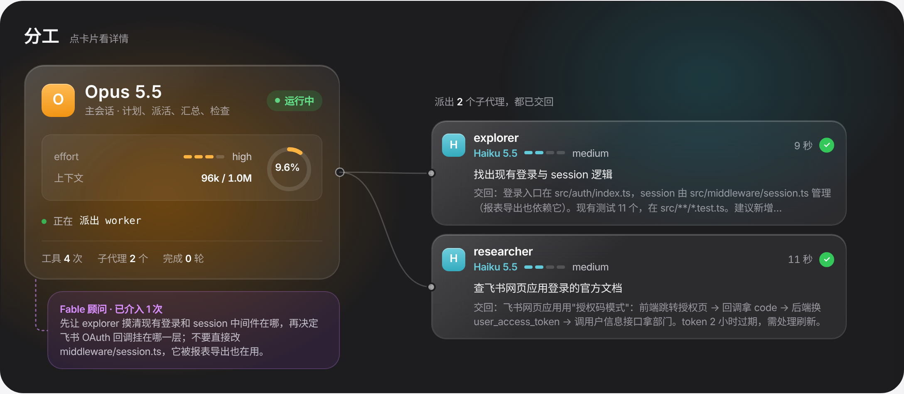
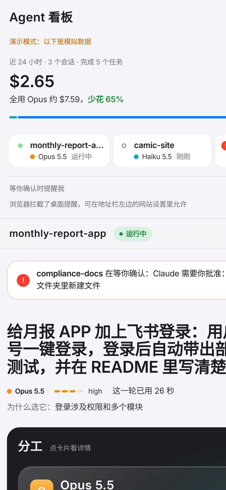
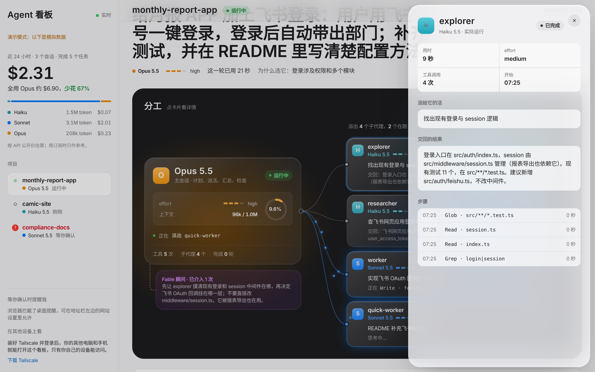
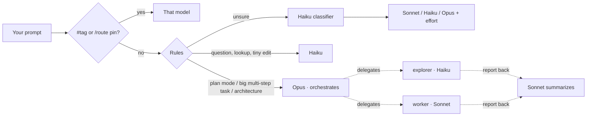

<div align="center">

# Claude Agent Tools

**Automatic model routing and a live agent dashboard for Claude Code.**<br>
Haiku answers the lookups, Sonnet does the daily work, Opus plans the big jobs —
and you watch every agent, model and dollar in real time.

[English](README.md) · [简体中文](README.zh-CN.md)




<sub>Demo data. Full-quality video: <a href="docs/demo.mp4">docs/demo.mp4</a></sub>

</div>

## Why

Claude Code uses one model for everything unless you keep typing `/model`. That means paying Opus prices to ask *"where is the login code?"*, or asking Sonnet to architect a migration. And when a session fans out into sub-agents, you can't see who is doing what.

This repo ships two small tools that fix both:

| | What it does |
|---|---|
| **auto-router** | A Claude Code plugin that picks the model and effort **every turn**, and for every sub-agent. Simple questions go to Haiku, everyday coding to Sonnet, architecture and multi-step jobs to Opus (which plans and delegates). In real sessions it cut estimated cost by **30–40%** versus running everything on Opus. |
| **agent-viz** | A local dashboard at `http://localhost:4321`: every project, the current task, a live tree of the main session and its sub-agents, which model each one runs, a model timeline, estimated cost and savings, and an alert when Claude is waiting for your approval. Works on your phone too. |

## Features

- **Per-turn routing** — keyword rules first, then a Haiku classifier for the rest. Tag a prompt with `#opus`, `#sonnet`, `#haiku` or `#fable` to override once; `/route opus` to pin.
- **Multi-model teamwork** — big tasks ("implement docs/spec.md") get Opus as the orchestrator, `explorer` sub-agents on Haiku to read code, `worker` sub-agents on Sonnet to write it.
- **Plan → execute** — in plan mode (Shift+Tab) Opus writes the plan; once you approve, Sonnet carries it out.
- **Guard rails** — Haiku hands over to Sonnet before editing a 4th file or running risky commands (`rm -rf`, `git push`, migrations, deploys); 3 tool failures in a turn escalate one tier on the spot; downgrades need two confirmations.
- **Cost-aware** — sub-agent results are summarized on Sonnet, not re-read by Opus; no model lock-in on long chats.
- **Live agent tree** — curved links with flowing particles while a sub-agent runs, a green pulse back when it reports, hover to trace a branch, click any card for its full brief, result and every tool step.
- **Model timeline & cost** — which model ran each turn and each sub-agent, token use per model, estimated cost and *how much you saved*.
- **"Needs you" alerts** — banner, desktop notification or sound when a session is blocked on your approval.
- **Anywhere access** — Tailscale (private, zero config) or your own domain via Cloudflare Tunnel + Access email login.
- **Apple-style liquid-glass UI**, light theme, mobile layout, reduced-motion support.

<table>
<tr>
<td width="62%"></td>
<td></td>
</tr>
<tr>
<td colspan="2"></td>
</tr>
</table>

## Install

**Requirements:** Claude Code 2.1.288 or newer, Node.js 18+, Git.

### macOS / Linux

```bash
git clone https://github.com/paxon-yang/claude-agent-tools.git ~/claude-agent-tools && bash ~/claude-agent-tools/install.sh
```

### Windows (beta)

In **PowerShell**:

```powershell
irm https://raw.githubusercontent.com/paxon-yang/claude-agent-tools/main/install.ps1 | iex
```

It clones the repo to `%USERPROFILE%\claude-agent-tools` and runs the same installer through Git Bash (which Claude Code on Windows already needs). The dashboard starts hidden at login from your Startup folder.

Then **restart Claude Code** and open <http://localhost:4321>.

### Update

```bash
bash ~/claude-agent-tools/update.sh
```

Or just tell Claude Code: *"run bash ~/claude-agent-tools/update.sh"*. Your `config.json` changes are kept.

## How routing works



Each turn's choice, and why, shows up in the Claude Code status line, in `/route`, and on the dashboard.

## Everyday use

| You type | What happens |
|---|---|
| `/route` | Current model and the last decisions |
| `/route rules` | The active rules |
| `/route sonnet` · `/route auto` · `/route off` | Pin a model · back to automatic · disable |
| `#opus refactor the auth module` | Use Opus for this prompt only |
| Shift+Tab, then *"go ahead"* | Opus plans, Sonnet executes |

## Configuration

Edit `~/.claude/auto-router/config.json` and restart Claude Code. The most useful keys:

| Key | Default | Meaning |
|---|---|---|
| `defaultTier` | `sonnet` | Used when nothing else decides |
| `bigTaskTier` | `opus` | Orchestrator for multi-step tasks — set to `sonnet` to save more |
| `handbackTier` | `sonnet` | Who summarizes sub-agent results |
| `subagents` | explorer→haiku, worker→sonnet … | Model per sub-agent type |
| `haikuGuard.maxFiles` | `3` | Files Haiku may edit before Sonnet takes over |
| `autoFable` | `false` | Let the hardest tasks go to Fable automatically |

Dashboard settings live in `~/.claude/viz/app/config.json` (port, prices used for estimates, remote access).

## Open the dashboard from other devices

- **Tailscale (private):** install Tailscale on the computer and your other devices with the same account. The dashboard listens on the Tailscale address automatically and shows the link in its sidebar.
- **Your own domain (Cloudflare):** create a Cloudflare Access application for the hostname (email one-time PIN), then run
  `bash ~/claude-agent-tools/agent-viz/cloudflare.sh board.example.com`.
  It creates a dedicated `agent-board` tunnel and never touches your other cloudflared config.

## Uninstall

```bash
bash ~/.claude/auto-router/uninstall.sh
bash ~/.claude/viz/app/uninstall.sh
```

Both make a backup before editing `~/.claude/settings.json` or `~/.claude/CLAUDE.md`.

## FAQ

**Does switching models lose context?** No. The conversation is kept; the only cost is that the new model reads it once without cache. That pays for itself within a dozen calls, which is why the router no longer refuses to downgrade on long chats.

**Does it send my data anywhere?** No. Routing runs inside Claude Code; the dashboard reads local files and listens on localhost (plus your Tailscale address, or a tunnel you set up).

**Is the cost exact?** It's an estimate from public API prices. On a subscription, treat it as relative.

## Roadmap

- English / Chinese UI switch (the UI and installer messages are Chinese today)
- Daily and weekly cost history
- Router feedback: tell it "wrong model" and it learns
- Native Linux autostart (systemd)

Issues and PRs are welcome — see [CONTRIBUTING](CONTRIBUTING.md).

## License

[MIT](LICENSE)
