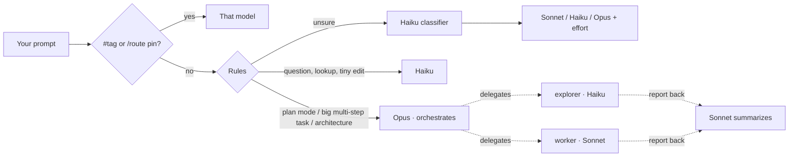
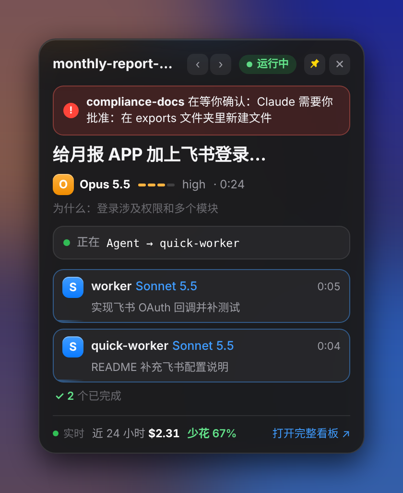

<div align="center">

# Claude Agent Tools

**Automatic model routing and a live agent dashboard for Claude Code.**<br>
Haiku answers the lookups, Sonnet does the daily work, Opus plans the big jobs —
and you watch every agent, model and dollar in real time.

**[▶ Try the live demo](https://paxon-yang.github.io/claude-agent-tools/)** · [English](README.md) · [简体中文](README.zh-CN.md)

[](https://github.com/paxon-yang/claude-agent-tools/actions/workflows/ci.yml)
[](https://github.com/paxon-yang/claude-agent-tools/releases)


<sub>Demo data. <a href="https://paxon-yang.github.io/claude-agent-tools/">Open the live demo</a> · <a href="docs/demo.mp4">full-quality video</a></sub>

</div>

## Why

Claude Code uses one model for everything unless you keep typing `/model`. That means paying Opus prices to ask *"where is the login code?"*, or asking Sonnet to architect a migration. And when a session fans out into sub-agents, you can't see who is doing what.

This repo ships two small tools that fix both:

| | What it does |
|---|---|
| **auto-router** | A Claude Code plugin that picks the model and effort **every turn**, and for every sub-agent. Simple questions go to Haiku, everyday coding to Sonnet, architecture and multi-step jobs to Opus (which plans and delegates). A built-in report shows what it saves you versus running everything on Opus — measured on your own transcripts, not promised. |
| **agent-viz** | A local dashboard at `http://localhost:4321`: every project, the current task, a live tree of the main session and its sub-agents, which model each one runs, a model timeline, estimated cost and savings, and an alert when Claude is waiting for your approval. Works on your phone too. |

## How it compares

| | **claude-agent-tools** | [claude-code-router](https://github.com/musistudio/claude-code-router) | [ccusage](https://github.com/ryoppippi/ccusage) | `/model` by hand |
|---|---|---|---|---|
| What it is | Plugin + local dashboard | Proxy in front of Claude Code | Usage analyzer CLI | Built in |
| Picks the model | **Every turn and every sub-agent**, automatically | By scenario (background, thinking, long context…), to any provider | — | You, when you remember |
| Stays on Anthropic models, no proxy | ✓ | Routes through its proxy | ✓ | ✓ |
| Sees sub-agents live | ✓ | — | — | — |
| Shows cost | Live, plus a savings-vs-Opus report | — | ✓ detailed usage & cost reports | — |

Use it alongside ccusage if you like its reports; use claude-code-router if you want non-Anthropic models. This project is for people who want to stay on Claude and stop overpaying for easy turns.

## Features

- **Per-turn routing** — keyword rules first, then a Haiku classifier for the rest. Tag a prompt with `#opus`, `#sonnet`, `#haiku` or `#fable` to override once; `/route opus` to pin.
- **Multi-model teamwork** — big tasks ("implement docs/spec.md") get Opus as the orchestrator, `explorer` sub-agents on Haiku to read code, `worker` sub-agents on Sonnet to write it.
- **Plan → execute** — in plan mode (Shift+Tab) Opus writes the plan; once you approve, Sonnet carries it out.
- **Guard rails** — Haiku hands over to Sonnet before editing a 4th file or running risky commands (`rm -rf`, `git push`, migrations, deploys); 3 tool failures in a turn escalate one tier on the spot; downgrades need two confirmations.
- **Cache-aware** — the prompt cache belongs to one model, so a switch makes the new model re-read the whole conversation at the cache-write price. While the current model's cache is warm, the router only downgrades when the turn will earn that back (it learns whether your cache lasts 5 minutes or 1 hour); the status line shows how long the cache has left.
- **Test gate** — when Haiku or Sonnet changed code, your tests run before the turn ends. If they fail, the turn steps up to Opus and keeps fixing — once per turn, never in a loop. Detects npm / pnpm / yarn / bun, pytest, cargo, go and `make test`; skipped when the model already ran the tests itself.
- **`/route` card, on your phone too** — model and why, cache time left, test gate, running sub-agents and session cost as one card in the terminal, the desktop app, and the Claude app via Remote Control.
- **Live agent tree** — curved links with flowing particles while a sub-agent runs, a green pulse back when it reports, hover to trace a branch, click any card for its full brief, result and every tool step.
- **Model timeline & cost** — which model ran each turn and each sub-agent, token use per model, estimated cost and *how much you saved*.
- **"Needs you" alerts** — banner, desktop notification or sound when a session is blocked on your approval.
- **Anywhere access** — Tailscale (private, zero config) or your own domain via Cloudflare Tunnel + Access email login; add it to your phone's home screen and it opens as an app on the card view.
- **Savings report** — `node ~/.claude/viz/app/report.js` reads your local transcripts: spend per model, all-Opus baseline, routed vs. un-routed sessions; `--md` for a shareable write-up.
- **English and 中文** — router messages, dashboard (with an EN | 中文 switch) and installers follow your system language.
- **Apple-style liquid-glass UI**, light theme, mobile layout, reduced-motion support.

<table>
<tr>
<td width="62%"></td>
<td></td>
</tr>
<tr>
<td colspan="2"></td>
</tr>
</table>

## Install

**Requirements:** Claude Code 2.1.288 or newer, Node.js 18+, Git.

### macOS / Linux

```bash
git clone https://github.com/paxon-yang/claude-agent-tools.git ~/claude-agent-tools && bash ~/claude-agent-tools/install.sh
```

### Windows (beta)

In **PowerShell**:

```powershell
irm https://raw.githubusercontent.com/paxon-yang/claude-agent-tools/main/install.ps1 | iex
```

It clones the repo to `%USERPROFILE%\claude-agent-tools` and runs the same installer through Git Bash (which Claude Code on Windows already needs). The dashboard starts hidden at login from your Startup folder.

Then **restart Claude Code** and open <http://localhost:4321>.

### Update

```bash
bash ~/claude-agent-tools/update.sh
```

Or just tell Claude Code: *"run bash ~/claude-agent-tools/update.sh"*. Your `config.json` changes are kept.

## How routing works



Each turn's choice, and why, shows up in the Claude Code status line, in `/route`, and on the dashboard.

## Everyday use

| You type | What happens |
|---|---|
| `/route` | A card: current model and why, cache time left, test gate, running sub-agents, session cost, recent decisions (also in the Claude app via Remote Control) |
| `/route rules` | The active rules |
| `/route sonnet` · `/route auto` · `/route off` | Pin a model · back to automatic · disable |
| `#opus refactor the auth module` | Use Opus for this prompt only |
| Shift+Tab, then *"go ahead"* | Opus plans, Sonnet executes |

## Desktop card (macOS / Windows)



A small always-on-top window with only what matters right now: the current task, model and effort, the step it is on, sub-agents and background tasks that are still running, and a red banner when a session is waiting for your approval. Drag it anywhere; the pin keeps it on top; the menu-bar / tray icon hides or shows it.

```bash
bash ~/claude-agent-tools/agent-viz/widget/install.sh
```

It downloads Electron once (~100 MB) and opens at login. The same card works in any browser at `http://localhost:4321/mini`, which is handy on a phone.

<br clear="right">

## How much did it save me?

```bash
node ~/.claude/viz/app/report.js            # last 7 days
node ~/.claude/viz/app/report.js --days 30 --md   # write claude-savings-YYYY-MM-DD.md to share
```

```
Claude Code · model routing savings
Last 7 days · 3 sessions · 7 model replies

  Model     Replies  Input  Cache read  Output  Est. cost  Share
  Haiku           3   190k        1.5M     80k      $0.10    <1%
  Sonnet          1   200k          2M    100k      $1.80    16%
  Opus            2   400k          3M    230k      $9.40    83%

  Estimated cost       $11.30
  All on Opus          $16.96
  Saved           33% ($5.66)
```

<sub>Sample output from the test fixtures. Estimates use public API prices; on a subscription it's an equivalent value, not your bill.</sub>

## Configuration

Edit `~/.claude/auto-router/config.json` and restart Claude Code. The most useful keys:

| Key | Default | Meaning |
|---|---|---|
| `defaultTier` | `sonnet` | Used when nothing else decides |
| `bigTaskTier` | `opus` | Orchestrator for multi-step tasks — set to `sonnet` to save more |
| `handbackTier` | `sonnet` | Who summarizes sub-agent results |
| `subagents` | explorer→haiku, worker→sonnet … | Model per sub-agent type |
| `haikuGuard.maxFiles` | `3` | Files Haiku may edit before Sonnet takes over |
| `autoFable` | `false` | Let the hardest tasks go to Fable automatically |
| `lang` | your system | `en` or `zh` for router messages |
| `cache.enabled` | `true` | Weigh the prompt cache before downgrading |
| `cache.ttlSeconds` | `"auto"` | Cache lifetime: `"auto"` learns it (starts at 1 hour), or `300` / `3600` |
| `cache.prices` | dashboard's | $ per million tokens per model; only the ratios matter |
| `qualityGate.enabled` | `true` | Run tests before finishing when a cheaper model changed code |
| `qualityGate.command` | detected | Test command for every project, e.g. `"npm run test:unit"` |
| `qualityGate.trustTier` | `opus` | Code changed by this model or above isn't checked |
| `qualityGate.timeoutSec` | `180` | Give up on a test run after this long |

Per project, `.claude/auto-router.json` in the project folder can set `{"testCommand": "pytest -q tests/unit"}` or turn the gate off with `{"qualityGate": false}`.

Dashboard settings live in `~/.claude/viz/app/config.json` (port, prices used for estimates, remote access, `lang`). Set `CAT_LANG=en` or `CAT_LANG=zh` before installing to force the installer language.

## Open the dashboard from other devices

- **Tailscale (private):** install Tailscale on the computer and your other devices with the same account. The dashboard listens on the Tailscale address automatically and shows the link in its sidebar.
- **Your own domain (Cloudflare):** create a Cloudflare Access application for the hostname (email one-time PIN), then run
  `bash ~/claude-agent-tools/agent-viz/cloudflare.sh board.example.com`.
  It creates a dedicated `agent-board` tunnel and never touches your other cloudflared config.

## On your phone

- **Drive Claude from your phone** with Claude Code's own [Remote Control](https://code.claude.com/docs/en/remote-control): `/config` → *Enable Remote Control for all sessions*, plus *Push when actions required* for approval alerts. Approvals, questions and pushes are all handled there.
- **Type `/route`** in the Claude app to see what the router is doing: the same card as in the terminal.
- **Android home-screen card** — a real widget for Android phones: task, model, sub-agents, cache, tests and cost on the home screen, live while a session is busy. Set up with one command and a QR scan: `bash ~/claude-agent-tools/agent-viz/phone.sh` ([guide](android/README.md)).
- **Add the board to your home screen** (Safari: Share → Add to Home Screen; Chrome: ⋮ → Add to Home screen) through your Tailscale or Cloudflare address. It opens full-screen on the card; *Open full board* and *‹ Card* switch between the two.

## Uninstall

```bash
bash ~/.claude/auto-router/uninstall.sh
bash ~/.claude/viz/app/uninstall.sh
```

Both make a backup before editing `~/.claude/settings.json` or `~/.claude/CLAUDE.md`.

## FAQ

**Does switching models lose context?** No. The conversation is kept; the cost is that the new model re-reads it once at the cache-write price, while the current model would have read it from cache at a tenth of the input price. In a long conversation that can outweigh a whole turn's savings, so while the cache is warm the router compares the two and stays put when switching wouldn't pay (`/route` shows the reason with the dollar estimate). With a cold cache, or a Haiku-sized task, it switches freely.

**Will the test gate run my whole suite every turn?** Only on turns where Haiku or Sonnet edited code (not docs), and not when the model already ran the tests after its last edit. Turn it off per project with `.claude/auto-router.json` or globally with `qualityGate.enabled: false`.

**Does it send my data anywhere?** No. Routing runs inside Claude Code; the dashboard reads local files and listens on localhost (plus your Tailscale address, or a tunnel you set up).

**Is the cost exact?** It's an estimate from public API prices. On a subscription, treat it as relative.

## Roadmap

- Daily and weekly cost history on the dashboard
- Router feedback: tell it "wrong model" and it learns
- Native Linux autostart (systemd)

Issues and PRs are welcome — see [CONTRIBUTING](CONTRIBUTING.md) and the [changelog](CHANGELOG.md).

## License

[MIT](LICENSE)
