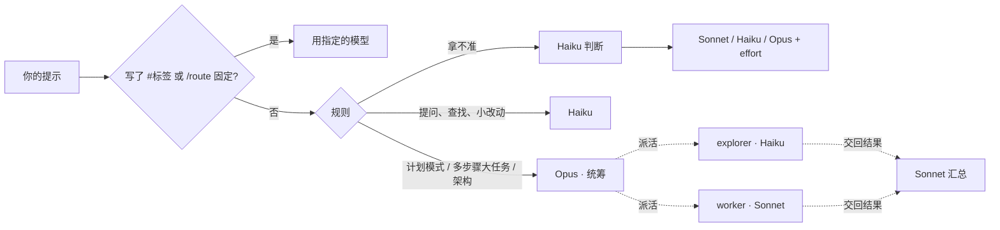

<div align="center">

# Claude Agent Tools

**给 Claude Code 自动选模型 + 实时代理看板。**<br>
简单问题交给 Haiku，日常开发交给 Sonnet，大任务由 Opus 统筹派活——
每个代理用的什么模型、花了多少钱，实时看得见。

**[▶ 在线看演示](https://paxon-yang.github.io/claude-agent-tools/)** · [English](README.md) · [简体中文](README.zh-CN.md)

[](https://github.com/paxon-yang/claude-agent-tools/actions/workflows/ci.yml)
[](https://github.com/paxon-yang/claude-agent-tools/releases)


<sub>演示数据。<a href="https://paxon-yang.github.io/claude-agent-tools/">打开在线演示</a> · <a href="docs/demo.mp4">高清视频</a></sub>

</div>

## 为什么做这个

Claude Code 默认一个模型干到底，想换就得自己敲 `/model`。结果要么用 Opus 的价格问"登录代码在哪"，要么让 Sonnet 去设计整个迁移方案。会话派出一堆子代理以后，谁在干什么也看不见。

这个仓库有两个小工具：

| | 做什么 |
|---|---|
| **auto-router** | Claude Code 插件。**每一轮**、每个子代理都自动选模型和 effort：提问查找给 Haiku，日常开发给 Sonnet，架构和多步骤大任务给 Opus（负责计划和派活）。自带的报告会用你自己电脑上的真实记录，算出比全程用 Opus 少花了多少。 |
| **agent-viz** | 本地看板 `http://localhost:4321`：所有项目、当前任务、主会话和子代理的实时分工图、每个节点用的模型、模型时间轴、估算花费和省了多少；Claude 等你批准时会提醒你。手机上也能看。 |

## 和其他工具的区别

| | **claude-agent-tools** | [claude-code-router](https://github.com/musistudio/claude-code-router) | [ccusage](https://github.com/ryoppippi/ccusage) | 手动 `/model` |
|---|---|---|---|---|
| 是什么 | 插件 + 本地看板 | 架在 Claude Code 前面的代理 | 用量分析命令行 | 自带 |
| 怎么选模型 | **每一轮、每个子代理**自动选 | 按场景（后台、思考、长上下文……）转发，可接任意厂商 | — | 你记得时自己换 |
| 只用 Anthropic 模型、不经代理 | ✓ | 经过它的代理 | ✓ | ✓ |
| 实时看到子代理 | ✓ | — | — | — |
| 看花费 | 实时 + 对比全用 Opus 的报告 | — | ✓ 详细的用量和费用报告 | — |

喜欢 ccusage 的报表可以一起用；想接非 Anthropic 的模型用 claude-code-router。这个项目适合想继续用 Claude、又不想在简单问题上多花钱的人。

## 功能

- **每轮自动选模型**：先按规则判断，拿不准再让 Haiku 判断。提示里写 `#opus` `#sonnet` `#haiku` `#fable` 只对这一句生效；`/route opus` 固定模型。
- **多模型协作**：大任务（比如"按照 docs/spec.md 修改"）由 Opus 统筹，`explorer` 子代理用 Haiku 读代码，`worker` 子代理用 Sonnet 写代码。
- **先计划后执行**：计划模式（Shift+Tab）里 Opus 出方案，批准后换 Sonnet 动手。
- **保护**：Haiku 要改第 4 个文件、或要跑 `rm -rf`、`git push`、迁移、部署这类命令时，先换 Sonnet 接手；一轮里失败 3 次当场升一档；降档要连续两轮确认。
- **看缓存再换模型**：提示缓存只对同一个模型有效，换模型等于让新模型按"写缓存"价把整段对话重读一遍。当前模型缓存还热时，只有这一轮能省回来才降档（会自己判断你的缓存是 5 分钟还是 1 小时）；状态栏显示缓存还剩多久。
- **测试关卡**：Haiku 或 Sonnet 改了代码，收工前先跑一遍测试；没过就当场升到 Opus 接着修——每轮最多一次，不会死循环。自动识别 npm / pnpm / yarn / bun、pytest、cargo、go、`make test`；模型自己已经跑过测试就不重复跑。
- **`/route` 卡片，手机上也能看**：现在用哪个模型、为什么、缓存还剩多久、测试关卡、在跑的子代理、这个会话花了多少，一张卡片；终端、桌面 App、通过 Remote Control 的手机 Claude App 里都能看。
- **实时分工图**：子代理在跑时连线上有光点流动，交回结果时一颗绿点流回主会话；悬停高亮这条线；点任意卡片看它领到的活、交回的结果和每一步工具调用。
- **模型时间轴和花费**：每一轮、每个子代理用的模型，按模型统计 token、估算费用和**省了多少**。
- **等你确认提醒**：会话卡在等你批准时，顶部横幅、桌面通知或提示音。
- **随处访问**：Tailscale（私有，零配置），或用 Cloudflare 隧道挂到自己的域名 + 邮箱验证码登录；添加到手机主屏幕后像 App 一样打开，直接是卡片。
- **省钱报告**：`node ~/.claude/viz/app/report.js` 读你本机的会话记录，算出每个模型花了多少、全用 Opus 要多少、自动选模型接管的会话和其他会话各省多少；加 `--md` 生成可以分享的报告。
- **中文和英文**：选模型的提示、看板（左下角 EN | 中文 一键切换）、安装脚本都跟随系统语言。
- **苹果风格液态玻璃界面**，浅色，适配手机，尊重"减少动态效果"设置。

<table>
<tr>
<td width="62%"></td>
<td></td>
</tr>
<tr>
<td colspan="2"></td>
</tr>
</table>

## 安装

**需要：** Claude Code 2.1.288 或更新、Node.js 18+、Git。

### macOS / Linux

打开"终端"，粘贴这一行：

```bash
git clone https://github.com/paxon-yang/claude-agent-tools.git ~/claude-agent-tools && bash ~/claude-agent-tools/install.sh
```

### Windows（测试版）

打开 **PowerShell**，粘贴这一行：

```powershell
irm https://raw.githubusercontent.com/paxon-yang/claude-agent-tools/main/install.ps1 | iex
```

它会把仓库下载到 `%USERPROFILE%\claude-agent-tools`，再用 Git Bash 跑同一个安装脚本（Windows 上的 Claude Code 本来就需要 Git Bash）。看板放在"启动"文件夹里，登录 Windows 后在后台自动运行。

装完**重开 Claude Code**，浏览器打开 <http://localhost:4321>。

### 更新

```bash
bash ~/claude-agent-tools/update.sh
```

或者直接跟 Claude Code 说："运行 bash ~/claude-agent-tools/update.sh"。你改过的 `config.json` 会保留。

## 选模型的逻辑



每一轮选了什么、为什么，Claude Code 底部状态栏、`/route` 命令和看板上都能看到。

## 日常用法

| 你输入 | 效果 |
|---|---|
| `/route` | 一张卡片：当前模型和原因、缓存还剩多久、测试关卡、在跑的子代理、花费、最近的选择（手机 Claude App 里通过 Remote Control 也能用） |
| `/route rules` | 当前规则 |
| `/route sonnet` · `/route auto` · `/route off` | 固定模型 · 恢复自动 · 关闭 |
| `#opus 重构登录模块` | 只这一句用 Opus |
| Shift+Tab，然后回"执行" | Opus 出方案，Sonnet 动手 |

## 桌面小卡片（macOS / Windows）


一个浮在桌面上的小窗口，只放现在最重要的东西：当前任务、用的模型和 effort、正在做哪一步、还在跑的子代理和后台任务；有会话等你确认时会出现红色提醒。可以拖到任意位置，图钉按钮让它总在最前，菜单栏（Windows 是右下角托盘）里的图标可以隐藏或显示。

```bash
bash ~/claude-agent-tools/agent-viz/widget/install.sh
```

第一次会下载 Electron（约 100 MB），之后登录电脑自动打开。不想装的话，浏览器打开 `http://localhost:4321/mini` 也是同一张卡片，手机上看很方便。

<br clear="right">

## 到底省了多少？

```bash
node ~/.claude/viz/app/report.js                   # 近 7 天
node ~/.claude/viz/app/report.js --days 30 --md    # 生成 claude-savings-日期.md，方便分享
```

```
Claude Code · 自动选模型省了多少
近 7 天 · 3 个会话 · 模型回复 7 次

  模型      回复次数   输入  缓存读取   输出  估算花费  占比
  Haiku            3   19万     150万    8万     $0.10   <1%
  Sonnet           1   20万     200万   10万     $1.80   16%
  Opus             2   40万     300万   23万     $9.40   83%

  实际约                   $11.30
  全用 Opus 约             $16.96
  少花          33%（省下 $5.66）
```

<sub>上面是测试数据的示例输出。按 API 公开价估算；用订阅的话这是等值金额，不是你的账单。</sub>

## 设置

编辑 `~/.claude/auto-router/config.json`，然后重开 Claude Code。常用的几项：

| 设置 | 默认 | 意思 |
|---|---|---|
| `defaultTier` | `sonnet` | 都判断不了时用的模型 |
| `bigTaskTier` | `opus` | 多步骤大任务的统筹者，改成 `sonnet` 更省钱 |
| `handbackTier` | `sonnet` | 谁来汇总子代理交回的结果 |
| `subagents` | explorer→haiku，worker→sonnet … | 每种子代理用的模型 |
| `haikuGuard.maxFiles` | `3` | Haiku 最多改几个文件就换 Sonnet |
| `autoFable` | `false` | 最难的任务自动交给 Fable |
| `lang` | 跟随系统 | 提示语言：`zh` 或 `en` |
| `cache.enabled` | `true` | 降档前先算缓存账 |
| `cache.ttlSeconds` | `"auto"` | 缓存时长：`"auto"` 自己判断（先按 1 小时），或写 `300` / `3600` |
| `cache.prices` | 跟看板一致 | 每个模型每百万 token 的价格，只看相对大小 |
| `qualityGate.enabled` | `true` | 便宜的模型改了代码，收工前先跑测试 |
| `qualityGate.command` | 自动识别 | 所有项目统一用的测试命令，比如 `"npm run test:unit"` |
| `qualityGate.trustTier` | `opus` | 这一档及以上改的代码不检查 |
| `qualityGate.timeoutSec` | `180` | 测试超过这么久就不等了 |

单个项目可以在项目目录的 `.claude/auto-router.json` 里写 `{"testCommand": "pytest -q tests/unit"}`，或者用 `{"qualityGate": false}` 关掉测试关卡。

看板的设置在 `~/.claude/viz/app/config.json`（端口、估算用的价格、远程访问、`lang`）。安装前设 `CAT_LANG=zh` 或 `CAT_LANG=en` 可以指定安装提示的语言。

## 在其他设备上看

- **Tailscale（私有）**：电脑和其他设备都装 Tailscale、登录同一个账号，看板会自动在 Tailscale 地址上开放，左下角显示链接。
- **自己的域名（Cloudflare）**：先在 Cloudflare Zero Trust 给这个网址建一个 Access 应用（邮箱验证码），再运行
  `bash ~/claude-agent-tools/agent-viz/cloudflare.sh board.你的域名`。
  它只新建一条名为 `agent-board` 的隧道，不动你其他的 cloudflared 设置。

## 在手机上用

- **在手机上指挥 Claude**：用 Claude Code 自带的 [Remote Control](https://code.claude.com/docs/en/remote-control)。`/config` 里打开 *Enable Remote Control for all sessions*，再打开 *Push when actions required*（等你批准时推送）。批准、回答问题、推送通知都在那里。
- **在 Claude App 里输入 `/route`**，看自动选模型现在在干什么，和终端里是同一张卡片。
- **把看板添加到主屏幕**（Safari：分享 → 添加到主屏幕；Chrome：⋮ → 添加到主屏幕），用你的 Tailscale 或 Cloudflare 地址打开。点开全屏显示卡片，"打开完整看板"和"‹ 卡片"来回切换。

## 卸载

```bash
bash ~/.claude/auto-router/uninstall.sh
bash ~/.claude/viz/app/uninstall.sh
```

改 `~/.claude/settings.json` 和 `~/.claude/CLAUDE.md` 之前都会先备份。

## 常见问题

**换模型会丢上下文吗？** 不会。对话都在，代价是新模型要按"写缓存"价把整段对话重读一遍，而留在原模型只要按输入价的十分之一读缓存。长对话里这笔钱可能比一整轮省下的还多，所以缓存还热时，自动选模型会先算账，换了不划算就不换（`/route` 里能看到原因和估算的金额）。缓存已经过期、或者换到 Haiku 这种便宜得多的模型时，照常换。

**测试关卡会不会每轮都跑一遍测试？** 只有 Haiku 或 Sonnet 这一轮改了代码（只改文档不算）、而且改完它自己没跑过测试时才跑。单个项目用 `.claude/auto-router.json` 关，全局用 `qualityGate.enabled: false` 关。

**会把我的数据发出去吗？** 不会。选模型在 Claude Code 里完成；看板只读本机文件，只在本机（以及你的 Tailscale 地址或你自己配的隧道）上开放。

**花费准吗？** 按 API 公开价估算。用订阅的话只看相对多少。

## 路线图

- 看板上按天、按周的花费历史
- 选错模型时一键反馈，让规则自己学
- Linux 开机自启（systemd）

欢迎提 Issue 和 PR，见 [CONTRIBUTING](CONTRIBUTING.md) 和[更新日志](CHANGELOG.md)。

## 许可

[MIT](LICENSE)
